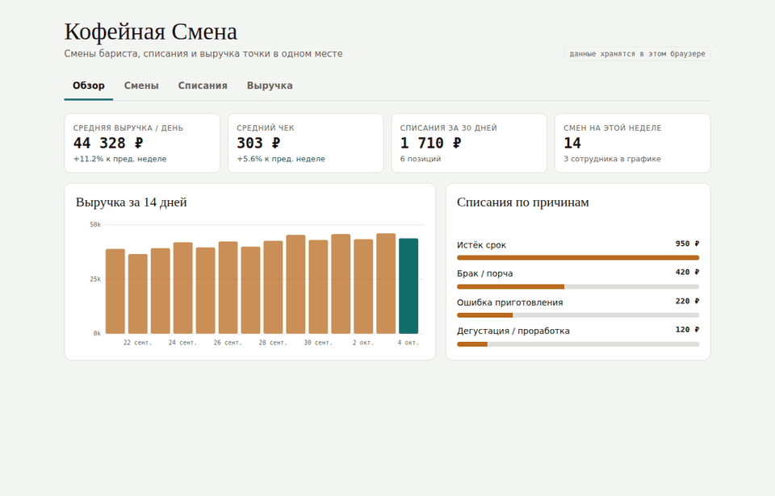
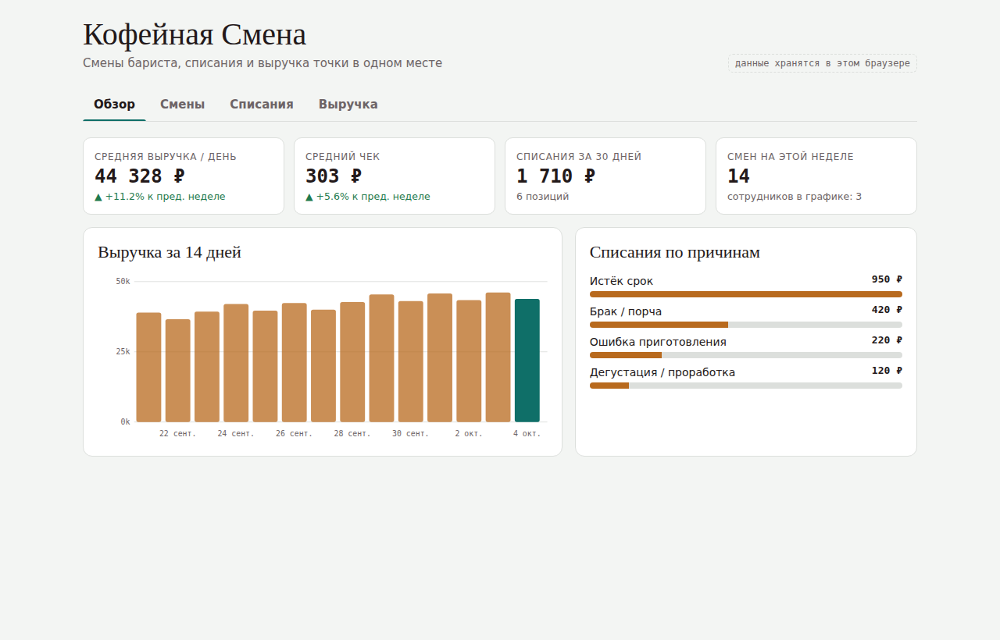
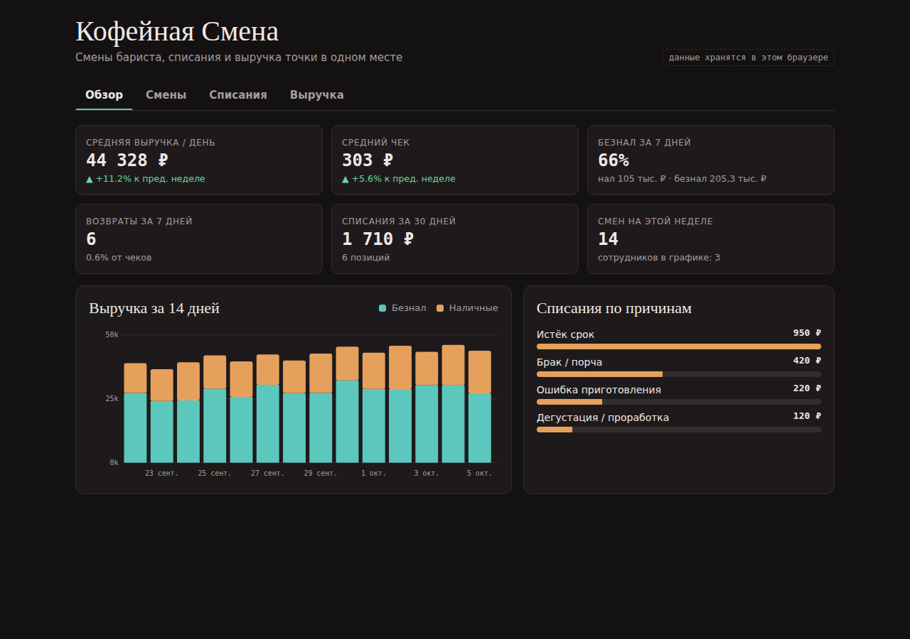
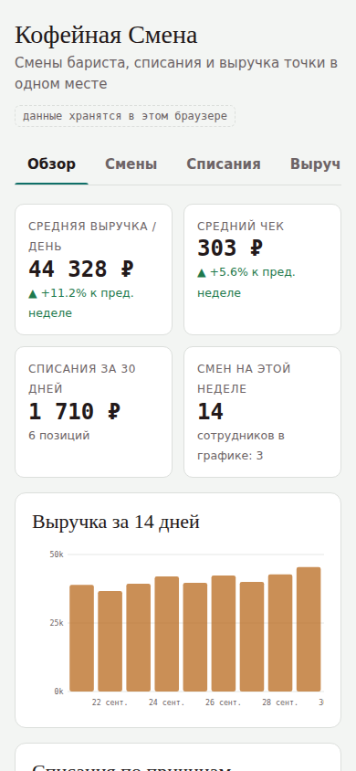

<div align="center">

# ☕ Кофейная Смена

**Мини-сервис для управляющего кофейней: смены бариста, списания и выручка в одном месте**

[](https://yaki-gl.github.io/coffee-shift/)
[](https://github.com/YaKi-gl/coffee-shift/actions/workflows/deploy.yml)


### [▶ Открыть демо](https://yaki-gl.github.io/coffee-shift/)



</div>

---

## 📌 Содержание

- [О проекте](#-о-проекте)
- [Для кого и зачем](#-для-кого-и-зачем)
- [Возможности](#-возможности)
- [Анимации](#-анимации)
- [Скриншоты](#-скриншоты)
- [Стек технологий](#-стек-технологий)
- [Архитектура](#-архитектура)
- [Быстрый старт](#-быстрый-старт)
- [Тесты и CI/CD](#-тесты-и-cicd)
- [Roadmap](#-roadmap)
- [Автор](#-автор)

---

## 💡 О проекте

**Кофейная Смена** — веб-приложение для управляющего небольшой кофейней. В нём сведены три вещи, которые обычно живут в разных таблицах и тетрадях: **график смен**, **журнал списаний** и **выручка по дням**.

Проект основан на моём опыте **управляющего кофейней**: команда из 3 бариста, 5 поставщиков, ежедневный контроль выручки и потерь.

## 🎯 Для кого и зачем

| Кто | Какую задачу решает |
|---|---|
| **Управляющий точкой** | Видит выручку, средний чек и потери на одном экране, а не в трёх таблицах |
| **Владелец** | Понимает, куда уходят деньги: списания разбиты по причинам |
| **Бариста** | Видит свой график смен на неделю |

> 📉 На таком учёте я сократил списания на своей точке на **30–35%** и поднял средний чек с **280 до 310 ₽** за счёт допродаж.

## ✨ Возможности

- 📊 **Обзор**: средняя выручка и средний чек с **динамикой неделя к неделе**, доля безнала, возвраты и их % от чеков, списания за 30 дней, график выручки «безнал + наличные», разбивка списаний по причинам
- 🗓 **Смены**: недельный график с перелистыванием, добавление и удаление смен
- 🗑 **Списания**: журнал с причинами (срок, брак, ошибка приготовления, проработка)
- 💰 **Выручка**: наличные и безнал раздельно (итог дня считается на лету), чеки продажи и **чеки возврата**; средний чек считается автоматически
- 💾 Данные сохраняются в браузере, при первом запуске загружаются примеры за 2 недели
- 🌗 Светлая и тёмная тема, адаптивная вёрстка

## 🎬 Анимации

| Где | Что происходит | Как сделано |
|---|---|---|
| Вкладки | Подчёркивание «переезжает» к активной вкладке, содержимое сменяется со сдвигом | `layoutId` + `AnimatePresence mode="wait"` |
| KPI | Карточки появляются каскадом, суммы «докручиваются» | `staggerChildren`, `animate()` |
| График выручки | Столбцы вырастают от оси по очереди: сначала безнал, сверху наличные | SVG `height` + `attrY` с пружиной и задержкой |
| Причины списаний | Полосы заполняются по очереди | `width` 0 → N% |
| График смен | Неделя уезжает в сторону листания, новая въезжает с другой стороны | Варианты с параметром `custom={direction}` |
| Таблицы | Новая строка вспыхивает цветом, удалённая уходит влево | `layout` + `AnimatePresence` |
| Итог дня | Сумма «перелистывается» при вводе наличных и безнала | `AnimatePresence mode="popLayout"` |
| Формы | Кнопка на секунду становится зелёной «✓ Готово» | `animate={{ backgroundColor }}` |

## 🖼 Скриншоты

| Светлая тема | Тёмная тема |
|---|---|
|  |  |

<details>
<summary>📱 Мобильная версия</summary>
<br>

</details>

## 🛠 Стек технологий

| Слой | Технология | Для чего |
|---|---|---|
| UI | **React 19** | Компонентный интерфейс, хуки `useReducer`, `useMemo`, `useEffect` |
| Анимации | **Framer Motion 12** | Layout-анимации, `AnimatePresence`, пружины, жесты `whileHover` / `whileTap` |
| Сборка | **Vite 7** | Быстрый dev-сервер с HMR и оптимизированная production-сборка |
| Стили | **CSS** (Custom Properties, Grid, Flexbox) | Дизайн-токены, светлая и тёмная тема, адаптив. У каждого компонента свой `.css` |
| Графики | **SVG** (без библиотек) | График выручки построен вручную и анимирован Framer Motion |
| Тесты | **Vitest** | Юнит-тесты бизнес-логики и редьюсеров |
| Качество кода | **ESLint** + `eslint-plugin-react-hooks` | Правила хуков и единый стиль |
| CI/CD | **GitHub Actions** → **GitHub Pages** | На каждый push: тесты → сборка → деплой |
| Разработка | **Claude (AI-ассистент)** | Вайбкодинг: генерация и доработка кода по моим требованиям |

## 🏗 Архитектура

```
src/
├── main.jsx · App.jsx            # точка входа и переключение вкладок
├── config/constants.js           # вкладки, причины списаний, периоды отчётов
├── data/seed.js                  # генератор демо-данных за 2 недели
├── store/
│   ├── shopReducer.js            # изменения данных (чистая функция)
│   └── shopReducer.test.js
├── hooks/useCoffeeShop.js        # useReducer + автосохранение + actions
├── services/
│   ├── metrics.js                # бизнес-логика: средний чек, динамика, списания
│   ├── metrics.test.js
│   └── storage.js                # localStorage (легко заменить на API)
├── utils/                        # date.js (недели, даты), format.js (рубли, %)
├── styles/                       # tokens.css (темы) + global.css
└── components/
    ├── Header/ · Tabs/
    ├── Overview/                 # OverviewView, KpiCard, RevenueChart, ReasonsBreakdown
    ├── Shifts/                   # ShiftsView, WeekGrid
    ├── Writeoffs/                # WriteoffsView
    ├── Revenue/                  # RevenueView
    ├── motion/                   # общие анимации: presets, rowMotion
    └── ui/                       # Panel, EntryForm, RemoveButton, AnimatedNumber, EmptyState
```

**Поток данных** однонаправленный:

```
 форма / клик ─▶ actions ─▶ shopReducer ─▶ state ─▶ *View-компоненты
                                             │
                                             └─▶ storage.saveData()
                    services/metrics ◀── компоненты считают KPI из state
```

| Слой | Ответственность |
|---|---|
| `store/` | Единственное место, где меняются данные. Покрыто тестами |
| `services/metrics.js` | Расчёты кофейни без React: среднее, динамика, группировка списаний |
| `hooks/` | Связывает React с редьюсером и хранилищем |
| `components/` | Отображение и анимации. Каждая вкладка и каждый виджет в своей папке |

## ⚡ Быстрый старт

Нужен [Node.js](https://nodejs.org/) 20 или новее.

```bash
git clone https://github.com/YaKi-gl/coffee-shift.git
cd coffee-shift
npm install
npm run dev        # http://localhost:5173/coffee-shift/
```

| Команда | Что делает |
|---|---|
| `npm run dev` | Dev-сервер с горячей перезагрузкой |
| `npm test` | Запуск юнит-тестов (Vitest) |
| `npm run build` | Production-сборка в `dist/` |
| `npm run preview` | Локальный просмотр собранной версии |
| `npm run lint` | Проверка кода ESLint |

## ✅ Тесты и CI/CD

Покрыты юнит-тестами: все расчёты кофейни (`metrics.test.js`) и действия редьюсера (`shopReducer.test.js`).

Каждый push в `main` запускает workflow [`.github/workflows/deploy.yml`](.github/workflows/deploy.yml):

```
push → npm install → npm test → npm run build → деплой на GitHub Pages
```

Если хоть один тест падает, сломанная версия на сайт не попадёт.

## 🗺 Roadmap

- [x] Смены, списания, выручка, KPI с динамикой
- [x] React + Vite, анимации Framer Motion, тесты, CI/CD
- [ ] Учёт часов и расчёт зарплаты по сменам
- [ ] Экспорт в Excel / CSV
- [ ] Остатки и заказы у поставщиков
- [ ] Общая база для команды (бэкенд)

## 🤖 Как сделано

Проект собран в формате **вайбкодинга**: я формулировал требования, проверял результат и итеративно дорабатывал его вместе с AI-ассистентом. Продуктовая часть моя: сценарии, данные и метрики взяты из моего реального опыта.

## 👤 Автор

**Борис Фролов** — Release Manager, управляющий кофейней

[](https://github.com/YaKi-gl)

---

<div align="center">

⭐ Если проект показался полезным, поставьте звезду

</div>
